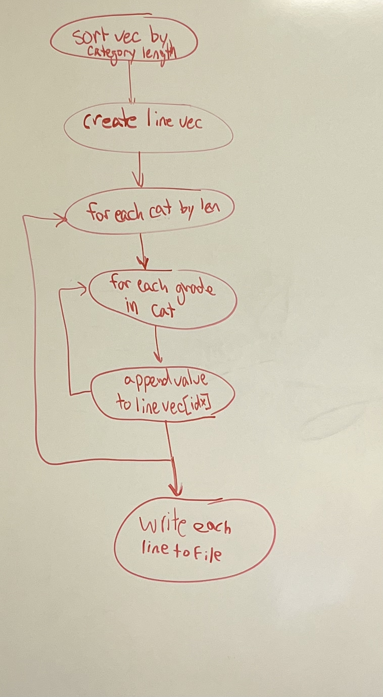

# Review-Project-SP23
A gradebook algorithm for CSC 212 review project

Group members:
Henry Czerwinski,
Matthew Sturtevant,
Andrew Bilodeau,
Dean Geraci

# Summary and Repo Address

This is a program which calculated a student's weighted average for CSC 212 by using the student's grade in each
category as well as the weight of each category as a part of the entire grade. The output of the program is both
A numerical representation and the letter grade corresponding with it.

Repo Address: https://github.com/sturtevantma/Review-Project-SP23

# Documentation

### Category
Category is a container of grades for the course  
`Category::name`  
The name of the category  
`Category::weight`  
The category's weight for your course grade   
`Category::grades`  
A vector of pairs containing all assignments and the achieved grades

### Course
Course is a class that helps store and calculate information about the grades in a given course  
`Course::current_grade`  
The users grade excluding incomplete work (represented with a -1 in the file)  
`Course::cum_grade`  
The users total grade including all work (incomplete counted as 0)  
`Course::read_file`  
Takes a file name and reads the data, invalid data will throw an exception  
`Course::write_file`  
Writes gradebook info to a file  
`Course::calc_grade()`  
Returns a float that contains your grade/100  
`Course::cat_grade`  
Returns the grade of the category  
`Course::search_grade()`  
Find grade by assignment name  
`Course::get_grades()`  
Returns all grades from the category  

### How to Compile
For the actual percentage representation for each category, the user needs to hard code their grade for each category before compiling.
When compiling, you need to type `g++ main.cpp gradebook.cpp`
To execute, type `./a.exe <file name>`
To use the program follow the on screen prompt.

# Planning
[general_planning](./planning/general_planning.pdf)  
  

